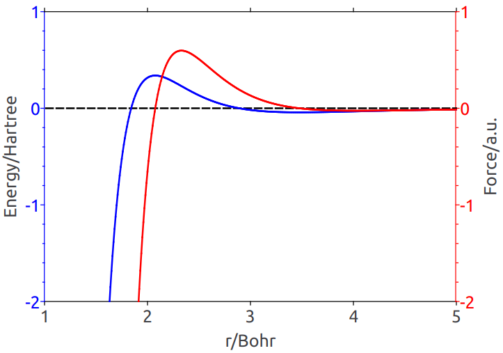

<!--
Copyright 2024 Weibo He.

This file is part of Physica.

Permission is granted to copy, distribute and/or modify this document
under the terms of the GNU Free Documentation License, Version 1.3
or any later version published by the Free Software Foundation;
with no Invariant Sections, no Front-Cover Texts, and no Back-Cover Texts.

You should have received a copy of the GNU Free Documentation License
along with Physica.  If not, see <https://www.gnu.org/licenses/>.
-->
# BKSModel

## Template Parameters

**AvoidTooNear**

**Figure 1** The BKS potential$^{[1]}$ is a Buckingham-type potential. The Buckingham potential exhibits an unphysical attractive force as $r \to 0$, as shown in the figure above, causing two atoms to approach each other indefinitely. In practice, solid SiO2 at low temperatures does not exhibit atoms coming too close. However, in high-temperature SiO2, atoms have sufficient kinetic energy to overcome the barrier and enter the attractive region on the left, leading to divergence of atomic coordinates.

The Buckingham potential is:

$$V(r) = A e^{-br} - \frac{c}{r^6}$$

$$F(r) = -\frac{\partial V}{\partial r} = Ab e^{-br} - \frac{6c}{r^7}$$

In practice, the above formula can be used at low temperatures. To prevent atoms from coming too close at high temperatures, the Buckingham potential is corrected as:

$$V_1(r) = \left\{ \begin{matrix} 2V(r_0) - V(r) \\ V(r) \end{matrix} \quad \begin{matrix} (r < r_0) \\ (r_0 \le r) \end{matrix} \right.$$

$$F_1(r) = \left\{ \begin{matrix} -F(r) \\ F(r) \end{matrix} \quad \begin{matrix} (r < r_0) \\ (r_0 \le r) \end{matrix} \right.$$

where $r_0$ satisfies $F(r_0) = 0$, solved numerically as:

$$r_0(\mathrm{O-O}) = 2.8414313142730038 \; \mathrm{Bohr}$$

$$r_0(\mathrm{Si-O}) = 2.0754014858102230 \; \mathrm{Bohr}$$

## Reference

[1] Phys. Rev. Lett. 64, 1955 (1990); https://doi.org/10.1103/PhysRevLett.64.1955
