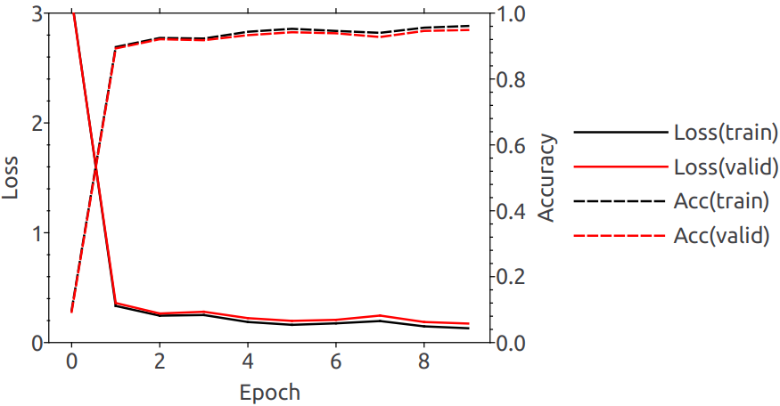

<!--
Copyright 2024 Weibo He.

This file is part of Physica.

Permission is granted to copy, distribute and/or modify this document
under the terms of the GNU Free Documentation License, Version 1.3
or any later version published by the Free Software Foundation;
with no Invariant Sections, no Front-Cover Texts, and no Back-Cover Texts.

You should have received a copy of the GNU Free Documentation License
along with Physica.  If not, see <https://www.gnu.org/licenses/>.
-->
# Notes on MNIST

训练32神经元的单隐藏层神经网络进行手写数字识别

**图1** Mnist训练曲线，使用Xavier-Normal初始化

输出层一般不需要添加偏置。实验发现若输出层有偏置则验证集精度只能达到80%，训练误差不下降，去除偏置后验证集精度为96%，和已有结果接近$^{[1]}$。

## Reference

[1] 2-layer NN; http://yann.lecun.com/exdb/mnist/
