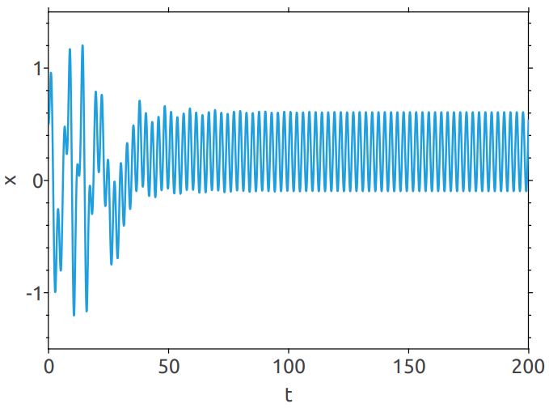
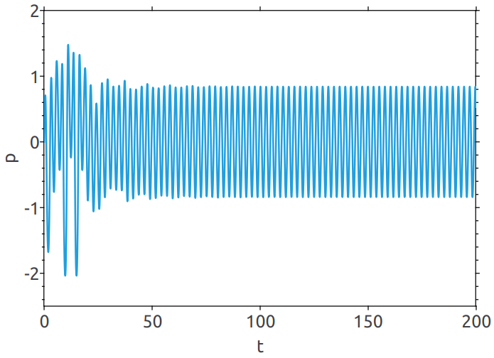

<!--
Copyright 2024-2026 Weibo He.

This file is part of Physica.

Permission is granted to copy, distribute and/or modify this document
under the terms of the GNU Free Documentation License, Version 1.3
or any later version published by the Free Software Foundation;
with no Invariant Sections, no Front-Cover Texts, and no Back-Cover Texts.

You should have received a copy of the GNU Free Documentation License
along with Physica.  If not, see <https://www.gnu.org/licenses/>.
-->
# DuffingOscillator

The example demonstrates how to use *Physica*'s ODESolver to solve ordinary dfferential equations

**Figure 1** Duffing oscillator position x as a function of time

**Figure 2** Duffing oscillator momentum p as a function of time

**Figure 3** Phase portrait (x-p) of the Duffing oscillator

## Reference

[1] J. H. Thijssen. Computational Physics[M]. London: Cambridge University Press, 2013:11-12
