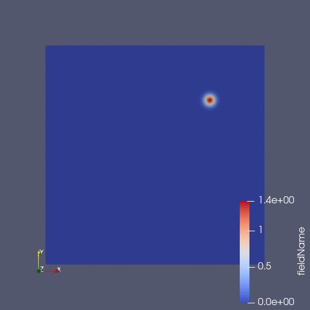

<!--
Copyright 2024-2026 Weibo He.

This file is part of Physica.

Permission is granted to copy, distribute and/or modify this document
under the terms of the GNU Free Documentation License, Version 1.3
or any later version published by the Free Software Foundation;
with no Invariant Sections, no Front-Cover Texts, and no Back-Cover Texts.

You should have received a copy of the GNU Free Documentation License
along with Physica.  If not, see <https://www.gnu.org/licenses/>.
-->
# FokkerPlanck

This example demonstrates how to solve a partial differential equation (PDE) using the finite element method.

Taking the Fokker-Planck equation for a damped harmonic oscillator as an example$^{[1]}$:

$$\frac{\partial W(x, p, t)}{\partial t} = [-\frac{p}{m} \frac{\partial}{\partial x} + \frac{\partial}{\partial p} (x + \gamma p) + \frac{\partial^2}{\partial p^2} D] W(x, p, t)$$

where $m$ is the mass of the oscillator, $x$ and $p$ are the position and momentum of the oscillator respectively, $\gamma$ is the damping coefficient, $D$ is the diffusion coefficient, and $W$ is the probability density distribution of the system.

**Figure 1** Evolution of the probability density $W(x, p, t)$ over time. The x-axis represents position and the y-axis represents momentum. Visualization was done using Paraview$^{[2]}$.

## Reference

[1] Nonlinear Dyn. 4, 357–372 (1993); <https://doi.org/10.1007/BF00120671>
[2] Paraview; <https://www.paraview.org/>
