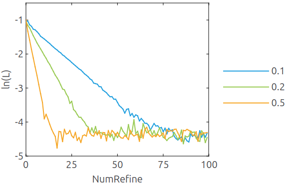
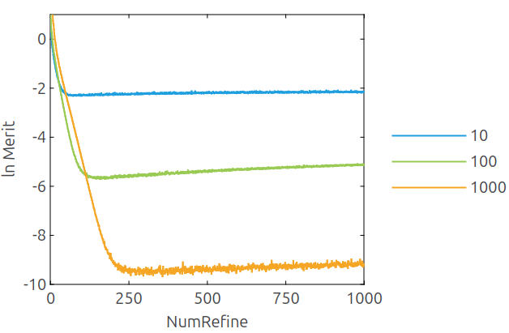
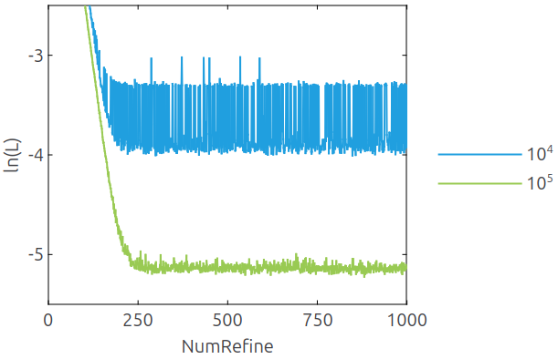

<!--
Copyright 2024-2026 Weibo He.

This file is part of Physica.

Permission is granted to copy, distribute and/or modify this document
under the terms of the GNU Free Documentation License, Version 1.3
or any later version published by the Free Software Foundation;
with no Invariant Sections, no Front-Cover Texts, and no Back-Cover Texts.

You should have received a copy of the GNU Free Documentation License
along with Physica.  If not, see <https://www.gnu.org/licenses/>.
-->
# Vegas - Adaptive Monte Carlo Integration

The Vegas algorithm$^{[1, 2]}$ adaptively adjusts the integration grid to reduce sampling error, considering an 8-dimensional integral.

$$I = \int_{-a}^a \text{d}\mathbf{x} \exp(-\frac{1}{2} \mathbf{x}^T \mathbf{x})$$

We define the grid loss function as the average of the *normalized* standard deviations of losses across all dimensions

$$L = \frac{1}{N} \sum_i^N \; \sigma(d_i) = \frac{1}{N} \sum_i^N \sqrt{\frac{\braket{d_i^2} - \braket{d_i}^2}{N_P \braket{d_i}^2}}$$

where $N$ is the number of dimensions, $N_P$ is the number of grid points per dimension, and $d_i$ is defined by equation (17) in [2].

**Fig. 1** The grid loss versus number of iterations. The compress rate controls the speed of grid adjustment; a larger compression rate leads to faster grid convergence, but an excessively large compression rate will cause instability.$^{[2]}$

**Fig. 2** A denser grid is generally able to achieve better grid loss.

**Fig. 3** Insufficient sample size will lead to instability during the grid improvement process.

The chi-square statistic can be used to evaluate the reliability of grid improvements. The theoretical value of $\chi^2$ is $1$, and a value significantly greater than $1$ may indicate that some details of the integrand have been lost.

## Reference

[1] J. Comput. Phys. 27, 192 (1978); https://doi.org/10.1016/0021-9991(78)90004-9
[2] J. Comput. Phys. 439, 110386 (2021); https://doi.org/10.1016/j.jcp.2021.110386
