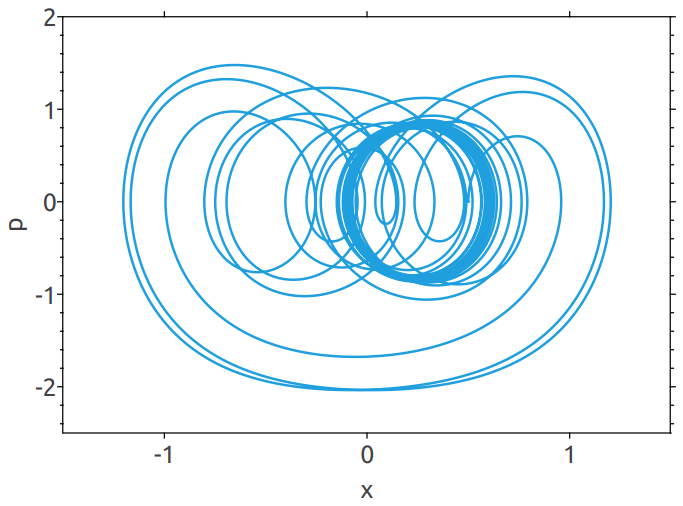

# DuffingOscillator

Duffing振子示例展示如何使用Physica的ODESolver求解常微分方程

**图1** Duffing振子位置x随时间变化

**图2** Duffing振子动量p随时间变化

**图3** Duffing振子的x-p相图

## Reference

[1] Jos Thijssen. Computational Physics[M]. London: Cambridge university press, 2013:11-12
