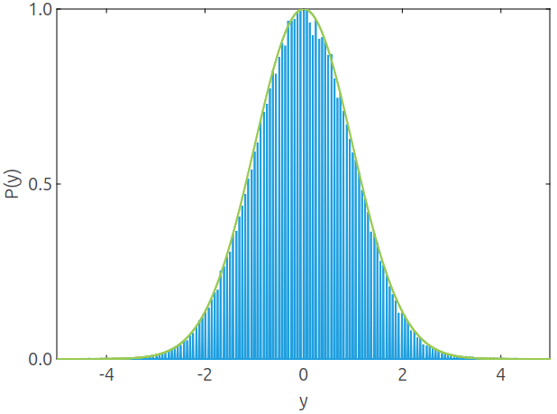

<!--
Copyright 2024 Weibo He.

This file is part of Physica.

Permission is granted to copy, distribute and/or modify this document
under the terms of the GNU Free Documentation License, Version 1.3
or any later version published by the Free Software Foundation;
with no Invariant Sections, no Front-Cover Texts, and no Back-Cover Texts.

You should have received a copy of the GNU Free Documentation License
along with Physica.  If not, see <https://www.gnu.org/licenses/>.
-->
# ProbDistribution

ProbDistribution computes the probability distribution function of a one-dimensional random variable using sampling semantics. Consider the random variable:

$$y = \ln\left( 1 + \sqrt{1-e^{-1/n}} \right) \sum_{i = 1}^n s_i$$

where the independent random variables $s_i = \pm 1$ follow a binomial distribution with $p = 1/2$.

**Fig. 1** Blue: probability density distribution of the random variable $y$; Green: standard normal distribution

All moments of the random variable $y$ equal those of a standard normal variable, and its moment-generating function exists, so $y \sim N(0, 1)$ as $n \to \infty$.
