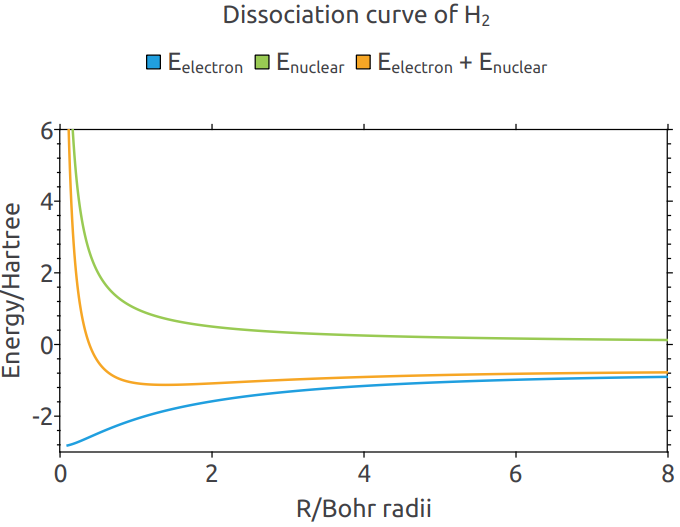

# HF

本示例展示如何使用Hartree-Fock近似计算孤立分子体系，以氢分子的解离曲线为例

**图1** 氢分子的解离曲线，能量最小值为$E_{min} = -1.126545057 \; \mathrm{Hartree}$，位置$r_0 = 1.38375 \; \mathrm{Bohr}$，与文献[1]的$r_0 = 1.38 \; \mathrm{Bohr}$吻合良好

## Reference

[1] Larsen A, Poulsen R S. Applied Hartree-Fock methods. https://projekter.aau.dk/projekter/files/213481562/report.pdf
