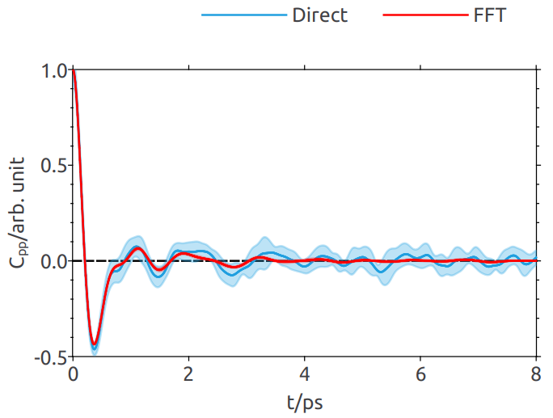

<!--
Copyright 2024-2026 Weibo He.

This file is part of Physica.

Permission is granted to copy, distribute and/or modify this document
under the terms of the GNU Free Documentation License, Version 1.3
or any later version published by the Free Software Foundation;
with no Invariant Sections, no Front-Cover Texts, and no Back-Cover Texts.

You should have received a copy of the GNU Free Documentation License
along with Physica.  If not, see <https://www.gnu.org/licenses/>.
-->
# Correlation

**Figure 1** Normalized momentum autocorrelation function of Kr crystal$^{[1]}$ at 186K, computed using both the direct method and the FFT method. Within statistical error, the two methods give consistent results. The implemented direct method only considers correlations from $t = 0$ forward, resulting in larger uncertainty compared to the FFT method.

## Reference

[1] Phys. Rev. 188, 1407 (1969); <https://doi.org/10.1103/PhysRev.188.1407>
