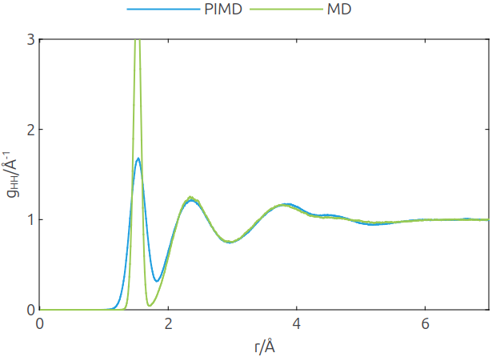

<!--
Copyright 2024 Weibo He.

This file is part of Physica.

Permission is granted to copy, distribute and/or modify this document
under the terms of the GNU Free Documentation License, Version 1.3
or any later version published by the Free Software Foundation;
with no Invariant Sections, no Front-Cover Texts, and no Back-Cover Texts.

You should have received a copy of the GNU Free Documentation License
along with Physica.  If not, see <https://www.gnu.org/licenses/>.
-->
# RDF

**图1** 298K下水的氢原子间RDF，PIMD结果与文献[1]吻合良好。由于核量子效应PIMD的第一个峰显著低于MD的第一个峰。

## Reference

[1] J. Chem. Phys. 131, 024501 (2009); https://doi.org/10.1063/1.3167790
