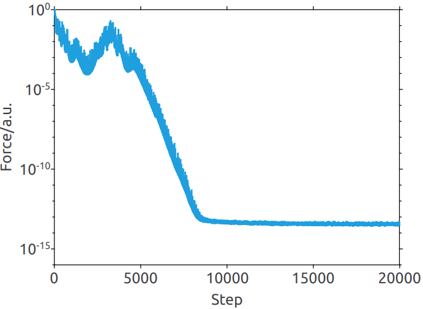
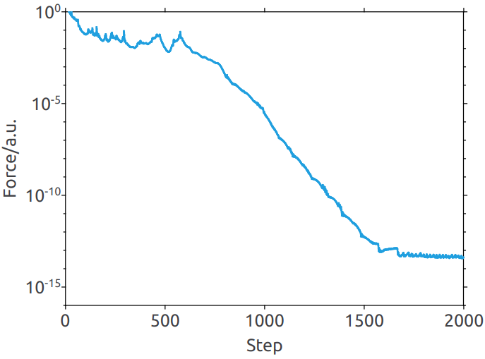
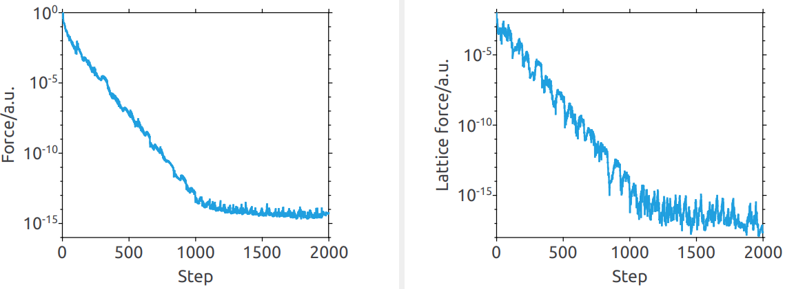
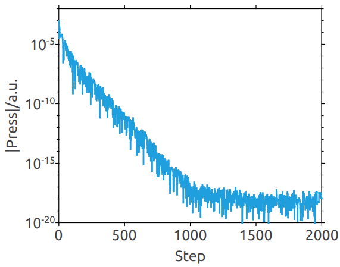
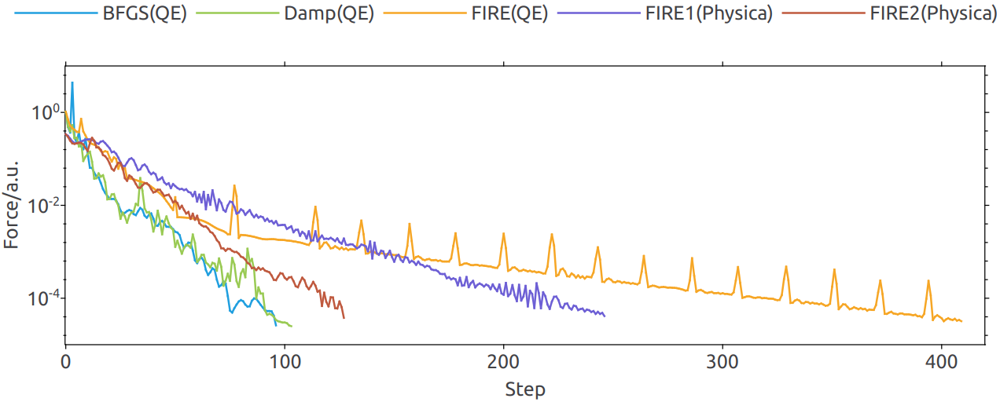
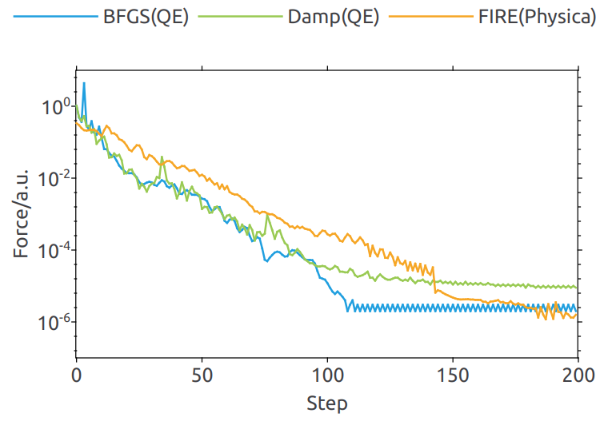

<!--
Copyright 2024-2025 Weibo He.

This file is part of Physica.

Permission is granted to copy, distribute and/or modify this document
under the terms of the GNU Free Documentation License, Version 1.3
or any later version published by the Free Software Foundation;
with no Invariant Sections, no Front-Cover Texts, and no Back-Cover Texts.

You should have received a copy of the GNU Free Documentation License
along with Physica.  If not, see <https://www.gnu.org/licenses/>.
-->
# FIRE结构优化

## Introduction

原子结构优化是第一性原理模拟或分子动力学模拟中重要的步骤。其中，FIRE结构优化算法相较于传统的共轭梯度算法具有显著的优势，其性能甚至能与更为复杂的拟牛顿法相媲美$^{[1]}$。本文演示如何使用FIRE算法进行定体结构优化和定压结构优化。我们还发现了固定步长的FIRE算法在性能上优于自适应步长的FIRE算法，这一发现为我们在实际应用中选择合适的算法提供了参考证据。

## 定体结构优化(FireModel)

**图1** 在优化的结构上添加高斯微扰后使用FIRE优化，力大小随迭代步数变换曲线，经1500步后接近双精度浮点数的$\epsilon$值

### 固定步长FIRE

FIRE算法$^{[1,2]}$初始步长为$\Delta t$，使用自适应步长$\tau_n$，FIRE的半隐式欧拉算法$^{[2]}$可记作

$$\mathbf{v}'_{n + 1} = \mathbf{v}_n + \frac{\mathbf F}{m} \tau_n$$

$$\mathbf{v}_{n + 1} = (1 - \alpha) \mathbf{v}'_{n + 1} + \alpha \frac{|\mathbf v'_{n + 1}|}{|\mathbf F|} \mathbf{F}$$

$$\mathbf{x}_{n + 1} = \mathbf{x}_n + \mathbf{v}_{n + 1} \tau_n$$

其中第二步根据向量共线定理，速度大小一定减小，体系能量降低

固定步长版本将自适应部分转移到$\lambda_n$上:

$$\mathbf{v}'_{n + 1} = \mathbf{v}_n + \lambda_n \frac{\mathbf F}{m} \Delta t$$

$$\mathbf{v}_{n + 1} = (1 - \alpha) \mathbf{v}'_{n + 1} + \alpha \frac{|\mathbf v'_{n + 1}|}{|\mathbf F|} \mathbf{F}$$

$$\mathbf{x}_{n + 1} = \mathbf{x}_n + \mathbf{v}_{n + 1} \Delta t$$

其中$\lambda_n = \tau_n / \Delta t$，这意味着可以固定步长版本可以用自适应步长的动力学步实现。由于混合步只需要力的单位向量，因此该修改对混合步没有影响。固定步长版本即自适应调整力的大小，实验发现该修改将显著提高优化效率

尝试复现文献[2]中优化6000K下的熔融SiO2

**图1** 自适应步长FIRE算法优化熔融SiO2结构，力随迭代步数变化曲线

**图2** 固定步长FIRE算法优化熔融SiO2结构，力随迭代步数变化曲线

由以上两图可知固定步长版本明显优于自适应步长版本，但自适应步长版本仍优于文献结果，原因不明

## 定压结构优化(CFireModel)

原始的FIRE算法$^{[1,2]}$没有考虑晶格自由度。主流的分子动力学和第一性原理计算软件LAMMPS$^{[4]}$和QE$^{[5]}$实现的FIRE算法均不支持变胞优化。有文献将位置自由度和晶格自由度结合但并未公布其细节$^{[6]}$。

由各向异性的SCR动力学方程，该方程等价于于过阻尼极限下的Parrinello-Rahman方程$^{[3]}$，将一阶方程改为二阶

$$\left\{ \begin{matrix} \mathrm{d} \mathbf{h} = \frac{\mathbf{\Pi}}{W} \mathrm{d}t \\ \mathrm{d} \mathbf{\Pi} = -\mathbf{Dh} \mathrm{d}t \end{matrix} \right.$$

其中$\mathbf{\Pi}$为晶格自由度的广义动量，$\mathbf{G = -Dh}$为晶格自由度的广义力，进行收敛性判定时FIRE算法使用力的2范数，这里晶格的收敛同样使用广义力的2-范数作为判据。类似地使用固定步长的半隐式欧拉积分法进行积分，混合步操作为

$$\mathbf{\Pi} = (1 - \alpha) \mathbf{\Pi}' + \alpha \frac{|\mathbf{\Pi}|}{|\mathbf{G}|}\mathbf{G}$$

**图1** 力和广义力随迭代步数变化曲线，经过1500迭代后，力和广义力均降低到机器精度

**图2** 压强随迭代步数变化曲线，经过1500迭代后，压强达到稳定的$10^{-18}$,，该数值小于双精度浮点数的$\epsilon$，因此不是达到机器精度的收敛判据

**断言**: 晶格质量的默认值可以设置为晶格矩阵自由分量的个数

## 与其他软件对比

**图1** 力随迭代步数变化曲线，固定步长FIRE算法的速度优于QE实现的自适应步长FIRE算法。FIRE1(质量未归一)花费约250步达到给定精度，FIRE2(质量归一)花费约125步达到给定精度。

**图2** 力随迭代步数变化曲线，固定步数为200步，Fire可到到比Damp更高的精度。

## Reference

[1] Phys. Rev. Lett. 97, 170201 (2006); https://doi.org/10.1103/PhysRevLett.97.170201
[2] Comput. Mater. Sci. 175, 109584 (2020); https://doi.org/10.1016/j.commatsci.2020.109584  
[3] https://doi.org/10.48550/arXiv.2111.06402  
[4] LAMMPS Doc; https://docs.lammps.org/min_style.html  
[5] QE Doc; https://www.quantum-espresso.org/Doc/INPUT_PW.html  
[6] Phys. Rev. B 93, 020508(R); https://doi.org/10.1103/PhysRevB.93.020508  
