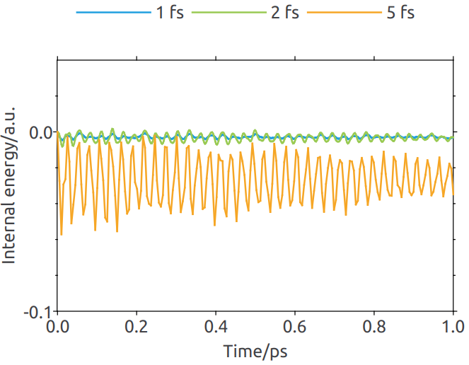

<!--
Copyright 2024 Weibo He.

This file is part of Physica.

Permission is granted to copy, distribute and/or modify this document
under the terms of the GNU Free Documentation License, Version 1.3
or any later version published by the Free Software Foundation;
with no Invariant Sections, no Front-Cover Texts, and no Back-Cover Texts.

You should have received a copy of the GNU Free Documentation License
along with Physica.  If not, see <https://www.gnu.org/licenses/>.
-->
# TestNVE

本实例演示如何使用testNVE函数测试积分步长的收敛性

**图1** 以二氧化硅为例，不同步长下系统内能随时间变化。由于使用的是NVE系综，系统能量应当守恒。5 fs的曲线步长过大导致能量曲线震荡，实际模拟中不宜采用。根据精度要求，选择1 fs或2 fs更为妥当。
