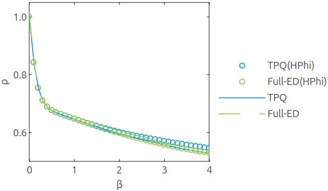

<!--
Copyright 2024-2025 Weibo He.

This file is part of Physica.

Permission is granted to copy, distribute and/or modify this document
under the terms of the GNU Free Documentation License, Version 1.3
or any later version published by the Free Software Foundation;
with no Invariant Sections, no Front-Cover Texts, and no Back-Cover Texts.

You should have received a copy of the GNU Free Documentation License
along with Physica.  If not, see <https://www.gnu.org/licenses/>.
-->
# TPQ

本示例用于演示如何制备TPQ态和使用TPQ态计算可观测量。

## Introduction

热力学纯态(Thermo Pure Quantum, TPQ)$^{[1]}$, 用于近似计算有限温多体系统的各种力学量和热力学量。随着系统格点数增加，计算结果依概率以指数速度收敛到严格解。这种收敛是相当快的，4格点的条件下TPQ结果已与精确对角化结果非常接近。TPQ相比精确对角化的改进在于，将计算有限温所需的$O(N)$个本征向量减少到1个随机向量，极大地减少了内存需求。

## 数值结果

**图1** 分别使用Physica和HPhi 3.5.2$^{[2]}$计算Hubbard模型倒温度$\beta$与粒子密度间关系，使用全对角化和TPQ两种方法，$U/t = 8$，格点数$L = 4$, 统计不确定度小于线宽。由于不能自适应地调整展开阶数，HPhi计算结果更快地积累数值误差。

    HPhi输入(FullDiag)
    model = "Fermion HubbardGC"
    method = "Full Diag"
    lattice = "chain"
    L = 4
    U = 8
    t = 1

    HPhi输入(TPQ)
    model = "Fermion HubbardGC"
    method = "cTPQ"
    lattice = "chain"
    L = 4
    U = 8
    t = 1
    lanczos_max = 161
    LargeValue = 10
    NumAve = 8192
    # ExpandCoef = 10 增加展开阶数以TPQ和Full-ED的偏差

经测试, 在Intel(R) Xeon(R) Platinum 8358 + 256G平台上，4x4 Hubbard模型上Physica相比HPhi 3.5.2快1300倍

## Reference

[1] Phys. Rev. Lett. 111, 010401 (2013); https://doi.org/10.1103/PhysRevLett.108.240401
[2] HPhi; https://github.com/issp-center-dev/HPhi.git
